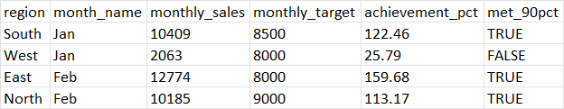

# Day7 – Polars Joins & Target Comparison

This project demonstrates **joins and multi-key relationships** in Polars.

## Datasets
- `sales_data.csv` → daily sales by region
- `targets.csv` → monthly target per region

## Pipeline
1. Parse dates → extract month name
2. Aggregate monthly sales per region
3. Join with targets
4. Compute achievement % and flag if ≥90%

## Example Output
