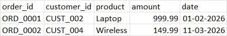
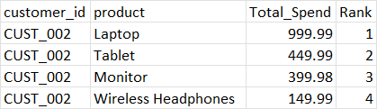
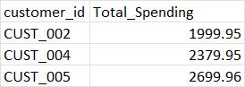
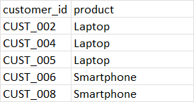

# Day8 – Customer Purchase Pattern Analysis

This project demonstrates customer analytics using **Polars**.  
We analyze purchase behavior across customers and products to identify spending patterns.

## 📂 Dataset
File: `customer_sales.csv`  
Columns:
- `order_id` → Unique order identifier
- `customer_id` → Customer reference
- `product` → Product purchased
- `amount` → Purchase amount
- `date` → Purchase date (DD-MM-YYYY)

## 🛠️ Pipeline Steps
1. **Load dataset** → Read CSV into Polars DataFrame.
2. **Rank products per customer by spend** → Group by `customer_id, product`, sum spend, and rank descending.
3. **Compute total spending per customer** → Aggregate spend across all products.
4. **Identify top product per customer** → Filter rank = 1 to find the highest‑spend product for each customer.

## 📊 Example Outputs

### Raw Purchases

### Ranking by Product per Customer

### Total Spending per Customer

### Top Product per Customer

## 🚀 Key Learnings
- Multi‑key grouping (`customer_id + product`)
- Ranking within partitions using `.rank().over("customer_id")`
- Aggregation for cumulative spending
- Filtering to extract top products per customer  

