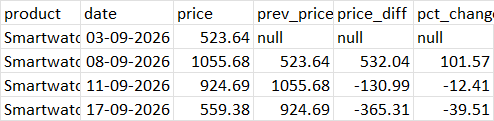
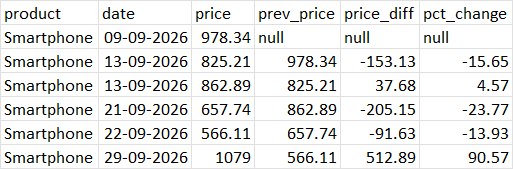

# Day9 – Product Price Change Tracker

This project demonstrates **time-series analysis** using Polars.  
We analyze product price changes over time, compute differences, and calculate percentage changes using `lag`.

## 📂 Dataset
File: `product_prices.csv`  
Columns:
- `product` → Product name
- `date` → Date of price record (YYYY-MM-DD)
- `price` → Price value

## 🛠️ Pipeline Steps
1. **Load dataset** → Read CSV into Polars DataFrame.
2. **Parse dates & sort** → Convert `date` to Polars `Date` type and sort by `product, date`.
3. **Lag previous price** → Use `.shift(1).over("product")` to get the previous price per product.
4. **Compute differences** → Calculate `price_diff` and `pct_change`.

## 📊 Example Output

### Smartwatch

### Smartphone

## 🚀 Key Learnings
- Using `lag` (`shift`) to access previous values in time-series data.
- Calculating differences and percentage changes.
- Sorting by multiple keys (`product, date`) for chronological analysis.
- Building a reusable pipeline for price change tracking.  
